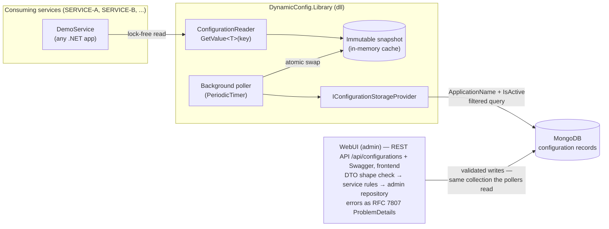

# DynamicConfig — Dynamic Configuration Library for .NET 8

A reusable .NET 8 class library that replaces static configuration files (`appsettings.json`, `web.config`, `app.config`) with a **live, storage-backed configuration system**. Configuration values are stored in MongoDB, managed through a web UI, and picked up by running services **without any deployment, restart, or recycle**. Each service sees only its own active configuration records, and the library keeps working from its last known-good snapshot even when storage goes down.

## Architecture



> A RabbitMQ event path (WebUI publishes `config-changed`, the library refreshes instantly) is a planned EXTRA — see [ADR 0005](docs/adr/0005-polling-plus-broker-hybrid.md).

## How It Works

1. **Initialization** — a service constructs the reader with exactly three parameters:
   `new ConfigurationReader(applicationName, connectionString, refreshTimerIntervalInMs)`.
   The reader immediately loads its records and starts a background refresh loop.
2. **Reads are lock-free** — `GetValue<T>(key)` reads from an **immutable in-memory snapshot**. No I/O, no locks, no `await` on the hot path.
3. **Polling refresh** — a `PeriodicTimer`-based background loop re-queries storage at the configured interval, builds a *new* immutable snapshot off to the side, and swaps it in atomically (single reference swap). Readers never observe a half-updated state.
4. **Resilience** — if storage becomes unreachable, the refresh cycle fails *silently for readers*: the last successfully loaded snapshot stays in place and `GetValue<T>` keeps serving it. When storage recovers, the next cycle swaps in fresh data.
   *First-load behavior:* **fail-fast** — if storage is unreachable at startup, the constructor throws. The fallback clause presupposes at least one successful load, a config-less service would misbehave on every read anyway, and a boot-time failure plugs straight into orchestrator restart policies ([ADR 0004](docs/adr/0004-fail-fast-initial-load.md)).
5. **Isolation** — the storage query itself filters by `ApplicationName` **and** `IsActive`. Records belonging to other services never enter a reader's memory, so isolation cannot be bypassed by an in-memory bug.
6. **Write path (admin)** — the WebUI's REST API (`/api/configurations`, browsable via `/swagger`) writes to the **same collection the pollers read**, so a saved change reaches every consumer within one poll interval. Two validation layers with zero overlap: DTO DataAnnotations reject shape garbage at the HTTP door; the admin service enforces semantics — crucially, *Value must be parseable as the declared Type*, checked with the **library's own parser** (single source of truth: what can be written is exactly what readers can parse; collection/database names are likewise shared constants). Every write stamps `LastModifiedDate` (UTC), and all errors leave as RFC 7807 ProblemDetails (400 + `fieldName`, 404 + `recordId`, 500 with no internals leaked) from one central exception handler.

*Planned EXTRA — broker-triggered refresh:* the WebUI will publish a `config-changed` event to a RabbitMQ fanout exchange on every change; each library instance consumes it and refreshes within milliseconds, with polling remaining the guaranteed fallback ([ADR 0005](docs/adr/0005-polling-plus-broker-hybrid.md)).

### Record schema

| Field | Type | Example |
|---|---|---|
| Id | ObjectId / string | `665f...` |
| Name | string | `SiteName` |
| Type | string (`string` \| `int` \| `double` \| `bool`) | `string` |
| Value | string (converted by the library) | `soty.io` |
| IsActive | bool | `true` |
| ApplicationName | string | `SERVICE-A` |

## Design Decisions

Every architectural decision is captured as an ADR in [`docs/adr/`](docs/adr/); the highlights:

### Why MongoDB (over Redis / MsSQL / file) — [ADR 0001](docs/adr/0001-mongodb-as-storage.md)
- **Query-level isolation:** a compound index on `(ApplicationName, IsActive)` makes the per-service filtered read the cheapest possible operation, and the filter lives in the storage query — not in application memory.
- **Heterogeneous values:** config records are schemaless by nature (`Value` is a string carrying an int, double, bool...). A document store fits this without column gymnastics.
- **No relational needs:** a single collection, no joins, no transactions — an RDBMS would add ceremony without benefit. Redis would work as a cache but offers weaker querying and no natural durable system-of-record semantics for a management UI.
- **Async-native driver:** the official MongoDB C# driver is async end-to-end, matching the library's fully asynchronous I/O paths (TPL / `async/await` bonus criterion).

### Why atomic snapshot swap (over locking) — [ADR 0002](docs/adr/0002-atomic-snapshot-swap.md)
- The read path (`GetValue<T>`) is the hot path — it must never block. Snapshots are **immutable dictionaries**; the refresh loop builds a complete new snapshot and publishes it with a single atomic reference swap (`Interlocked.Exchange` / `volatile` read).
- Readers therefore see either the *entire old* config set or the *entire new* one — never a torn, half-updated state. No reader/writer locks, no contention, no deadlock surface.
- This is the same pattern Node.js developers get for free from the single-threaded event loop — in multi-threaded .NET it must be engineered explicitly.

### Why storage sits behind an interface — [ADR 0003](docs/adr/0003-storage-behind-interface.md)
- `IConfigurationStorageProvider` (Strategy/Repository pattern) decouples `ConfigurationReader` from MongoDB. The core reader is unit-tested against a mocked provider — no database required.
- Swapping Mongo for Redis, SQL, or a file provider is a new implementation of one small interface; the reader, conversion engine, and refresh loop are untouched.

### Why polling + broker hybrid (planned EXTRA) — [ADR 0005](docs/adr/0005-polling-plus-broker-hybrid.md)
- **Polling** (mandatory, always on) gives *guaranteed consistency*: correct with no extra infrastructure, catches anything a lost message would miss.
- **Broker (RabbitMQ)** adds *low latency*: a fanout `config-changed` event refreshes every subscribed reader within milliseconds of a UI change. Events are signals, not state — MongoDB stays the single source of truth.
- Each covers the other's weakness: broker down → polling still converges; long poll interval → broker still delivers instant updates.

> **Note — no authentication (deliberate):** the case does not require auth, so the admin UI ships without it; in production this surface would sit behind a reverse proxy with SSO or ASP.NET Core Identity/JWT. See [phase-4.md](docs/phases/phase-4.md).

## Usage

```csharp
using DynamicConfig.Library;

// Exactly three parameters, as required by the case.
var reader = new ConfigurationReader(
    applicationName: "SERVICE-A",
    connectionString: "mongodb://localhost:27017",
    refreshTimerIntervalInMs: 5000);

// Typed reads — conversion happens inside the library.
string siteName   = reader.GetValue<string>("SiteName");     // "soty.io"
bool   basketOn   = reader.GetValue<bool>("IsBasketEnabled");
int    maxItems   = reader.GetValue<int>("MaxItemCount");
double rate       = reader.GetValue<double>("ConversionRate");

// Unknown key            -> ConfigurationKeyNotFoundException
// Wrong type for a key   -> ConfigurationTypeMismatchException (strict: no int->double widening)
// Corrupt stored value   -> ConfigurationValueFormatException (fix the record, not the code)
// Inactive record        -> not visible (treated as not found)
// Other service's record -> not visible (filtered at the storage query)
```

## Running the Project

Prerequisites: Docker (for storage) + .NET 8 SDK.

```bash
# 1. Start storage
docker-compose up -d

# 2. Run the web UI and the demo service
dotnet run --project src/DynamicConfig.WebUI
dotnet run --project src/DynamicConfig.DemoService
```

| Service | URL | Notes |
|---|---|---|
| Web UI (config management) | http://localhost:8080 | list / add / update, client-side name filter |
| Demo service (library consumer) | http://localhost:8081 | shows live config values for `SERVICE-A` |
| MongoDB | mongodb://localhost:27017 | database `DynamicConfigDb` (default when the connection string names none) |

Change a value in the Web UI and watch the demo service pick it up within one poll interval (instant broker-pushed refresh is a planned EXTRA — Phase 5; single-command full-ecosystem docker-compose is planned for Phase 6).

## Running Tests

```bash
dotnet test
```

The core library is fully unit-tested against a mocked `IConfigurationStorageProvider` (no MongoDB needed). Coverage includes: type conversion for all four supported types, conversion-mismatch errors, key-not-found behavior, `ApplicationName`/`IsActive` isolation, refresh picking up new and changed records, and the storage-down → last-good-snapshot fallback.

## Requirements Coverage

### Mandatory requirements (all covered by CORE phases 0–4)

| Requirement (case) | Where |
|---|---|
| .NET 8 class library (dll) usable by any project type | `src/DynamicConfig.Library` |
| Record schema `Id, Name, Type, Value, IsActive, ApplicationName` | `ConfigurationRecord` model |
| Init with exactly 3 params (`applicationName, connectionString, refreshTimerIntervalInMs`) | `ConfigurationReader` constructor |
| Single public method `T GetValue<T>(string key)` | `ConfigurationReader.GetValue<T>` |
| Type handling inside the library (`string`, `int`, `double`, `bool`) | conversion engine in the library |
| Only `IsActive = 1` records returned | storage-level query filter |
| Each service sees only its own records | `ApplicationName` filter at storage query level + compound index |
| Periodic check for new records and value changes | `PeriodicTimer` background refresh loop |
| Works from last successful config when storage is unreachable | immutable snapshot kept on refresh failure |
| Web UI: list, add, update records | `src/DynamicConfig.WebUI` |
| Client-side filtering by Name | WebUI frontend |

### Extra points

Quality practices are embedded in the CORE phases (they are *how the code is written*, not deferrable features); infrastructure extras land in EXTRA phases 5–7.

| Bonus item | Status | Where |
|---|---|---|
| TPL, async/await | ✅ done (embedded in core) | all I/O paths async end-to-end from the first line |
| Concurrency-safe design | ✅ done (embedded in core) | immutable snapshot + atomic reference swap, lock-free reads ([ADR 0002](docs/adr/0002-atomic-snapshot-swap.md)) |
| Design & architectural patterns | ✅ done (embedded in core) | Strategy/Repository (`IConfigurationStorageProvider`), immutable snapshot |
| TDD | ✅ done (embedded in core) | tests land in the same phase as the code they specify; see commit history |
| Unit tests | ✅ done (embedded in core) | `tests/DynamicConfig.Library.Tests` (xUnit, mocked storage) |
| MongoDB/Redis storage | ✅ done | MongoDB (`mongo:7`), [ADR 0001](docs/adr/0001-mongodb-as-storage.md) |
| Runnable project | ✅ done | `docker-compose up -d` (storage) + `dotnet run` per service |
| Documentation | ✅ done | this README + [architecture doc](docs/architecture.md) + [ADRs](docs/adr/) + [phase docs](docs/phases/) |
| Source control | ✅ done | GitHub, conventional commits per phase |
| Message broker | 🔜 planned (Phase 5) | RabbitMQ `config-changed` fanout: WebUI publisher + library consumer ([ADR 0005](docs/adr/0005-polling-plus-broker-hybrid.md)) |
| docker-compose for the whole ecosystem | 🔜 planned (Phase 6) | single command boots mongo + rabbitmq + webui + demoservice |

## Repository Structure

```
dynamic-config-net/
├── CLAUDE.md                          # project constitution: decisions, phase table, standards
├── README.md                          # this file
├── docker-compose.yml                 # Phase 0: mongo only → Phase 6: full ecosystem
├── .claude/                           # AI workflow: review/compliance skills + build-test hook
├── docs/
│   ├── architecture.md                # end-to-end system picture (diagrams, flows, failure modes)
│   ├── adr/                           # architecture decision records (0001–000N)
│   └── phases/                        # one doc per completed development phase
├── src/
│   ├── DynamicConfig.Library/         # the deliverable dll: ConfigurationReader, providers, models
│   ├── DynamicConfig.WebUI/           # ASP.NET Core: REST API + frontend (list/add/update, name filter)
│   └── DynamicConfig.DemoService/     # sample service consuming the library
└── tests/
    └── DynamicConfig.Library.Tests/   # xUnit unit tests (mocked storage provider)
```

## Development Workflow

Development was AI-assisted using a structured phase/ADR workflow I designed: work proceeds in reviewed phases (each documented in [`docs/phases/`](docs/phases/)), every architectural decision is recorded as an ADR in [`docs/adr/`](docs/adr/), and the project constitution ([`CLAUDE.md`](CLAUDE.md)) plus custom compliance/review skills in [`.claude/`](.claude/) — including an automated build+test hook on every code edit — keep the process verifiable. The `.claude/` directory is committed intentionally to make that workflow inspectable.
