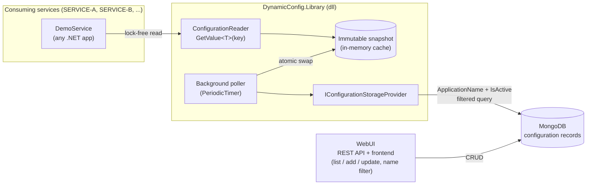
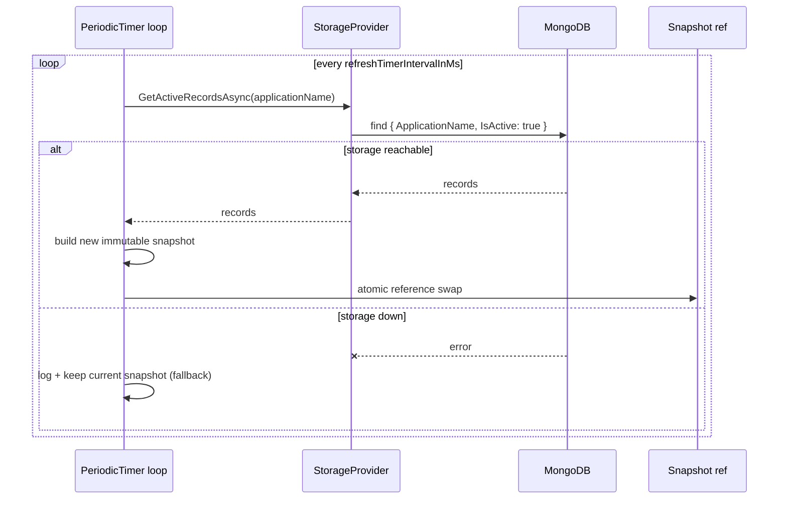
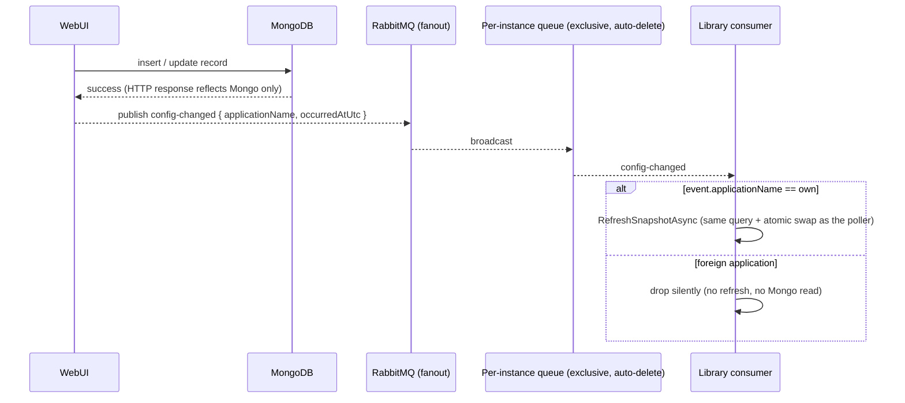

# Architecture

End-to-end picture of the DynamicConfig system. For the reasoning behind each choice, see the ADRs in [`docs/adr/`](adr/). Delivery was CORE-first: phases 0–4 shipped the mandatory scope, EXTRA phases 5–6 added the broker acceleration and the full docker-compose ecosystem — all sections below are implemented.

## System Overview (CORE)

## Components (CORE)

| Component | Project | Responsibility |
|---|---|---|
| `ConfigurationReader` | `DynamicConfig.Library` | Public API: 3-param ctor + `T GetValue<T>(string key)`. Owns the snapshot and the refresh loop. |
| Immutable snapshot | `DynamicConfig.Library` | Frozen dictionary of the service's active records; the *only* thing the read path touches. Doubles as the storage-down fallback. |
| Background poller | `DynamicConfig.Library` | `PeriodicTimer` loop; re-queries storage every `refreshTimerIntervalInMs`, builds a new snapshot, swaps atomically. |
| `IConfigurationStorageProvider` | `DynamicConfig.Library` | Storage abstraction (Strategy/Repository). One method surface for "fetch my active records". |
| `MongoConfigurationStorageProvider` | `DynamicConfig.Library` | Mongo implementation; `(ApplicationName, IsActive)` compound index; the isolation filter lives in the query. |
| WebUI | `DynamicConfig.WebUI` | REST API + minimal frontend: list/add/update records, client-side name filter. |
| `IConfigurationAdminRepository` | `DynamicConfig.WebUI` | The WebUI's own admin data-access contract over the same Mongo collection — all applications, inactive included, read-write. Deliberately separate from `IConfigurationStorageProvider` (consumer contract: app-scoped, active-only, read-only); collection name and BSON mapping are shared via the library's public storage constants/class map. |
| `ConfigurationAdminService` | `DynamicConfig.WebUI` | Write-path business rules: required names, Type must be supported, Value must parse as Type (via the library's `ConfigurationValueParser` — same code as the read path), UTC `LastModifiedDate` stamping, not-found semantics. |
| `ConfigurationsController` | `DynamicConfig.WebUI` | Thin REST shell (`/api/configurations`): bind DTO → service call → wrap. No try/catch, no business checks. Swagger-documented at `/swagger`. |
| `GlobalExceptionHandler` | `DynamicConfig.WebUI` | The one exception→HTTP mapping (.NET 8 `IExceptionHandler`): validation → 400 + `fieldName`, not-found → 404 + `recordId`, unexpected → 500 leaking nothing. RFC 7807 ProblemDetails throughout. |
| Contracts (DTOs) | `DynamicConfig.WebUI` | The entity never crosses HTTP. Write requests: required fields via DataAnnotations, `IsActive` nullable (tri-state), no `Id`/`LastModifiedDate` properties (server-owned by type). Response carries the full read shape. |
| Frontend | `DynamicConfig.WebUI/wwwroot` | Vanilla JS single page served as static files (no framework/build pipeline — deliberate). One-way flow API → in-memory state → render; the name filter narrows the loaded array with zero network requests; 400s render field-level via the `fieldName` extension. |
| DemoService | `DynamicConfig.DemoService` | Proof-of-consumption: boots with the library and exposes its live config values. |

## Data Flows (CORE)

### Read path (hot, lock-free)

`GetValue<T>(key)` → volatile read of the current snapshot reference → dictionary lookup → typed conversion result. No I/O, no locks. Unknown key → `ConfigurationKeyNotFoundException`; declared type ≠ requested `T` → `ConfigurationTypeMismatchException`.

### Refresh path (background)

### Write path (admin, Phase 4.1 + 4.2)

HTTP client → `ConfigurationsController` (DataAnnotations reject shape garbage with an automatic 400) → `ConfigurationAdminService` validates semantics (names required, Type supported, Value parseable as Type) and stamps `LastModifiedDate` (UTC) → `MongoConfigurationAdminRepository` inserts/replaces by `_id` in the same collection the pollers read. Failures surface through `GlobalExceptionHandler` as RFC 7807 ProblemDetails (400 + `fieldName` / 404 + `recordId` / 500 generic). Invalid records are rejected *before* storage (write-side prevention); the library's `ConfigurationValueFormatException` remains the read-side net for records written past the UI.

## Failure Modes (CORE)

| Failure | Behavior | Guaranteed by |
|---|---|---|
| MongoDB unreachable at runtime | `GetValue<T>` keeps serving the last successful snapshot; poller retries every interval | Snapshot-as-fallback ([ADR 0002](adr/0002-atomic-snapshot-swap.md)) |
| MongoDB unreachable at startup | Constructor throws (fail-fast); host's restart policy retries the boot | [ADR 0004](adr/0004-fail-fast-initial-load.md) |
| Concurrent read during refresh | Reader sees entire old or entire new snapshot, never a mix | Atomic swap ([ADR 0002](adr/0002-atomic-snapshot-swap.md)) |
| Service reads another service's key | Impossible — records are filtered by `ApplicationName` in the Mongo query; foreign records never enter memory | Query-level isolation ([ADR 0001](adr/0001-mongodb-as-storage.md)) |

## Instant-Refresh Flow (broker, Phase 5 — [ADR 0005](adr/0005-polling-plus-broker-hybrid.md), accepted)

The speed layer on top of polling: the WebUI publishes a thin `config-changed` event (`{ applicationName, occurredAtUtc }` — a signal, never values) to a single RabbitMQ **fanout exchange** after every successful write. Each reader instance binds its own **exclusive auto-delete queue** (dies with the instance); on a message it drops foreign application names silently and otherwise early-triggers the **existing** `RefreshSnapshotAsync` path — the broker adds no new data path, and MongoDB stays the single source of truth. Polling remains the guaranteed-convergence base layer (≤1 interval), which makes the broker an accelerator, never a dependency.

Failure paths (both degrade to CORE behavior, by policy):
- **Publish fails** → the write still succeeds; log-and-continue, polling carries the change within one interval.
- **Broker down / unreachable from a consumer** → that reader runs polling-only, exactly the CORE contract.

Resolved (locked decision 8): the consumer's broker address comes from the `DYNAMIC_CONFIG_RABBITMQ_URI` environment variable — the case-frozen 3-param ctor has no slot for it. Set → hybrid mode; absent/blank **or malformed** → polling-only, never a boot failure (ADR 0005).

## Full ecosystem (Phase 6)

One command — `docker compose up -d --build` — boots mongo + rabbitmq + webui + demoservice with health-gated startup ordering; the from-scratch drill and the evaluator simulation (7/7 PASS) are documented in [phase-6.md](phases/phase-6.md).
