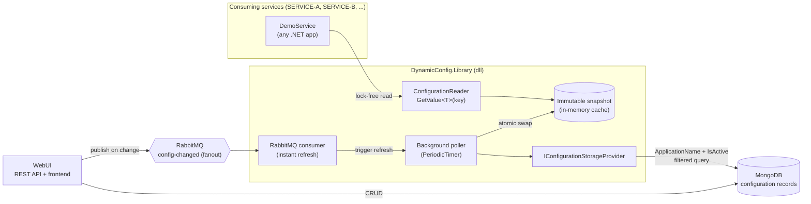
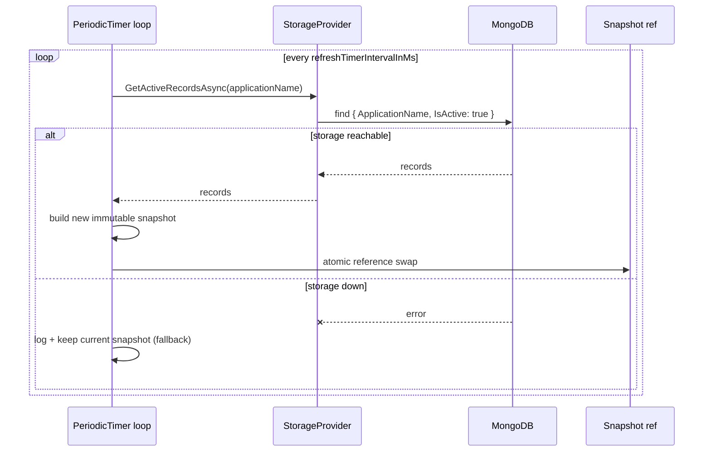
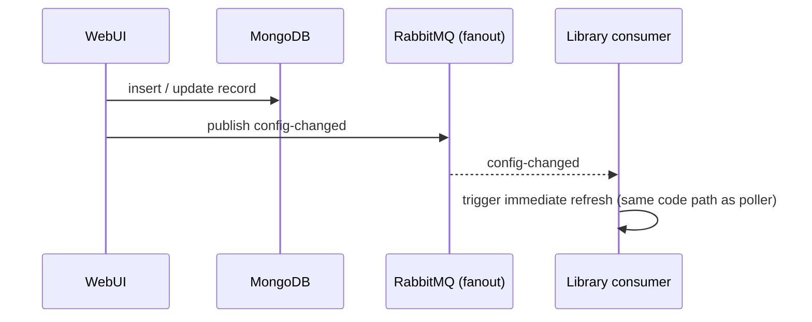

# Architecture

End-to-end picture of the DynamicConfig system. For the reasoning behind each choice, see the ADRs in [`docs/adr/`](adr/).

## System Overview

## Components

| Component | Project | Responsibility |
|---|---|---|
| `ConfigurationReader` | `DynamicConfig.Library` | Public API: 3-param ctor + `T GetValue<T>(string key)`. Owns the snapshot and the refresh loop. |
| Immutable snapshot | `DynamicConfig.Library` | Frozen dictionary of the service's active records; the *only* thing the read path touches. Doubles as the storage-down fallback. |
| Background poller | `DynamicConfig.Library` | `PeriodicTimer` loop; re-queries storage each interval, builds a new snapshot, swaps atomically. |
| RabbitMQ consumer | `DynamicConfig.Library` | Subscribes to the `config-changed` fanout exchange; triggers an immediate refresh (bonus path). |
| `IConfigurationStorageProvider` | `DynamicConfig.Library` | Storage abstraction (Strategy/Repository). One method surface for "fetch my active records". |
| `MongoConfigurationStorageProvider` | `DynamicConfig.Library` | Mongo implementation; `(ApplicationName, IsActive)` compound index; the isolation filter lives in the query. |
| WebUI | `DynamicConfig.WebUI` | REST API + minimal frontend: list/add/update records, client-side name filter; publishes `config-changed` on writes. |
| DemoService | `DynamicConfig.DemoService` | Proof-of-consumption: boots with the library and exposes its live config values. |

## Data Flows

### Read path (hot, lock-free)

`GetValue<T>(key)` → volatile read of the current snapshot reference → dictionary lookup → typed conversion result. No I/O, no locks, no allocation beyond the conversion. Unknown key → `ConfigurationKeyNotFoundException`; declared type ≠ requested `T` → `ConfigurationTypeMismatchException`.

### Refresh path (background)

### Event path (bonus, low latency)

The event only *schedules* a refresh — the data always comes from MongoDB. Messages are signals, not state, so a lost message costs at most one poll interval of staleness.

## Failure Modes

| Failure | Behavior | Guaranteed by |
|---|---|---|
| MongoDB unreachable at runtime | `GetValue<T>` keeps serving the last successful snapshot; poller retries every interval | Snapshot-as-fallback (ADR 0002) |
| MongoDB unreachable at startup | See ADR 0005 (Phase 3 decision) — current lean: empty snapshot + background retry | ADR 0005 (pending) |
| RabbitMQ down | Event refresh degrades away silently; polling still converges within one interval | Hybrid refresh (ADR 0003) |
| Lost/duplicate broker message | Harmless — refresh is idempotent and polling backstops losses | Signal-not-state design (ADR 0003) |
| Concurrent read during refresh | Reader sees entire old or entire new snapshot, never a mix | Atomic swap (ADR 0002) |
| Service reads another service's key | Impossible — records are filtered by `ApplicationName` in the Mongo query; foreign records never enter memory | Query-level isolation (ADR 0001) |
